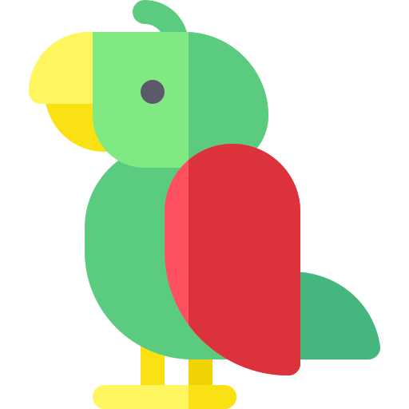
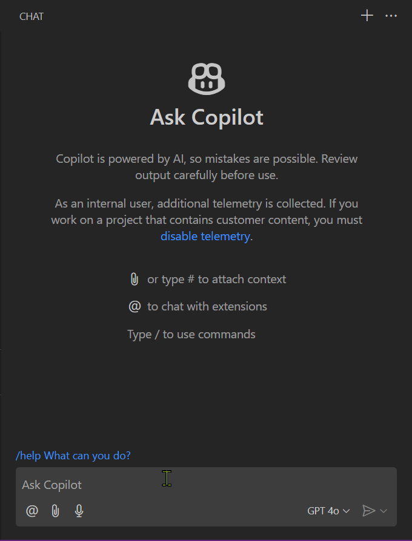
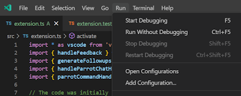

# Parrot GitHub Copilot VS Code Extension

This is a simple GitHub Copilot extension called Parrot. It doesn't do much, besides repeating what you say in GH Copilot chat windows when you address it with `@parrot`.

It doesn't do anything useful, and it's meant as a learning exercise as a companion repo for my series of blog posts about [GitHub Copilot extensions](https://pascoal.net//2024/10/22/gh-copilot-extensions/).

## Features

It only has two features:
- Parroting what you write, this doesn't require any kind of _intelligence_ so Gen AI is not involved in that.
- Parroting what you write as if the parrot was a pirate or like yoda one that talks.

It exercises a bunch of capabilities:

- References
- Provides followups
- Handling user feedback
- Configuration (you can disable talk like feature or followups)

## Requirements

Visual Studio Code 1.93 or later.

## Extension Settings

Some capabilities can be configured via the settings

This extension contributes the following settings:

* `tspascoal.copilot.parrot..like.Enabled`: Enable or disable the parrot talking like a pirate|yoda. (defaults to true)
* `tspascoal.copilot.parrot..ProvideFollowups`: Provide followups to the user's messages. (defaults to true)

## Running the extension

Since the extension is not available in the marketplace, in order to test you just need to clone the repository, open it on Visual Studio Code and run the extension with or without debugging (F5 and ctrl+F5 respectively).

## Logo attribution

The parrot [icon](https://www.flaticon.com/free-icon/parrot_1747903) used in this extension was created by Freepik and is available from [Flaticon](https://www.flaticon.com/free-icons/parrot) under a free license.

